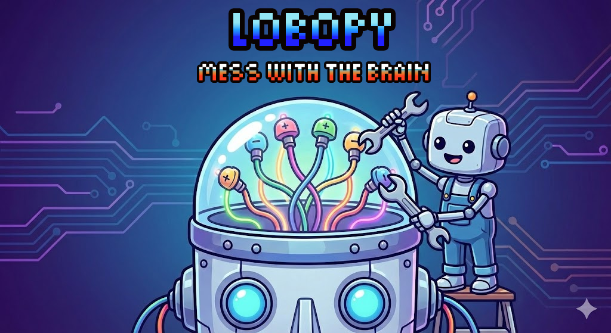

# Lobotomize (lobopy)



**Lobopy** is a lightweight PyTorch/HuggingFace library for analysing, steering the activations of causal language models. It provides an intuitive interface for computing and applying contrastive activation pathways during text generation.

### Nomenclature (In Context of Lobopy)

- [**Lobopy**](https://en.wikipedia.org/wiki/Lobotomy): Name of the module.
- [**Ambale**](https://tureng.com/en/turkish-english/ambale): Steered model, or model steering function.
- [**Patient**](./src/lobopy/patient.py): The wrapped model that is being analysed.

# Aim

With lobopy you can analyse how a model represents concepts, sentiments, or any other abstract idea and then use this information to steer the model towards or away from those concepts.

## Installation

Git:

```
git clone https://github.com/OzelTam/lobopy.git
cd lobopy
pip install -e .
```

## Quick Start

```python
from lobopy.patient import Patient, PatientConfig
from lobopy.aggregators import mean_aggregator, difference_aggregator
from lobopy.ambalefiers import (
    safe_scale_activation,
    top_k_layers,
    normalize_path,
)


model = Patient(
    pretrained_model_name_or_path="HUGGINGFACE_OR_LOCAL_MODEL_PATH",
    config=PatientConfig(...),
)

# Prompt datasets to analyse a concept. Depending on the model, these can be strings or dicts.
calm_prompts = ["I feel peaceful", ...]
anxious_prompts = ["I feel anxious", ...]


# Analyse the concepts
calm_reaction = model.analyse(prompts=calm_prompts,
                                aggregator=mean_aggregator(),
                                parallel=True,
                                max_workers=3,
                                save_checkpoint_every=2,
                                checkpoint_dir="checkpoint",
                                label="calm")

# Or without parallel processing & checkpointing
anxious_reaction = model.analyse(prompts=anxious_prompts,
                                label="anxious")

# Get neutral with averaging conflicting sentiment
mean_reaction = mean_aggregator()(calm_reaction.activations, anxious_reaction.activations)

# Calm path
calm_path = difference_aggregator()(calm_reaction.activations, mean_reaction.activations)

# Normalize and select top K layers
calm_path = normalize_path(calm_path)
# k is the number of layers to select, layer_range is the range of layers to select from (0 to 1)
calm_path = top_k_layers(calm_path, k=3, layer_range=(0.15, 0.75))

# Steering the model - Use .ambale() to create a new model with the steered activations
calm_model = model.ambale(calm_path, safe_scale_activation(factor=3.0))

# Generate with the steered model
output = calm_model.generate("I feel calm and peaceful", max_new_tokens=50)
print(output)

# Save the steered model
calm_model.save("calm_model.lobo")

# Load the steered model
loaded_calm_model = model.load_ambale("calm_model.lobo")
```

## Examples

- [Tiny Sample](./examples/tiny_sample.py) Uses **TinyLlama/TinyLlama-1.1B-Chat-v1.0**
- [Mid Sample](./examples/mid_sample.py): Uses **Nanbeige/Nanbeige4.1-3B**

## Sources

Here is some of the main sources that inspired the creation of this library:

- [Maxime Labonne - Uncensor any LLM with abliteration](https://huggingface.co/blog/mlabonne/abliteration)
- [Huggingface (YouTube) - Steering LLM Behavior Without Fine-Tuning](https://www.youtube.com/watch?v=F2jd5WuT-zg)
- [Welch Labs (YouTube) - The most complex model we actually understand](https://www.youtube.com/watch?v=D8GOeCFFby4)

## Planned Improvements

A nice improvement would be to add capability to analyse & capture the model's activations when a specific phrase, token or concept is generated.

With the most naive approach surely this process would be a semi-brute force process. But it might reveal some interesting insights about the model's internal representations.
